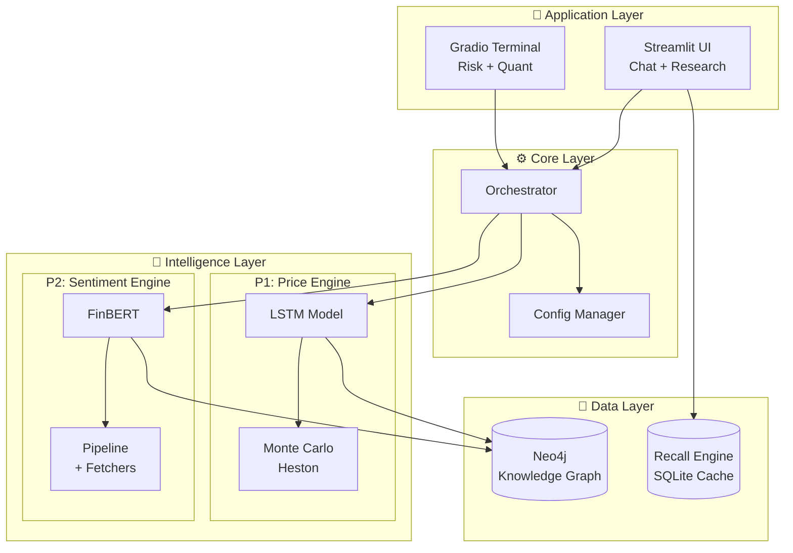
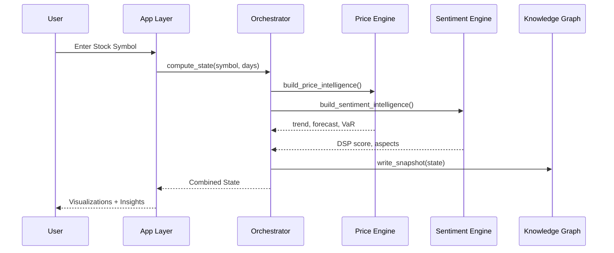

<p align="center">
  
  
  
  
  
</p>

<h1 align="center">🧠 FinWise Core</h1>
<h3 align="center">Institutional-Grade AI Financial Intelligence Platform</h3>

<p align="center">
  <em>Probabilistic · Regime-Aware · Non-Deterministic</em>
</p>

---

## 📋 Table of Contents

| Section | Description |
|---------|-------------|
| [Overview](#-overview) | What is FinWise Core? |
| [Architecture](#-architecture) | System design and data flow |
| [Project Structure](#-project-structure) | Folder organization |
| [Features](#-key-features) | Core capabilities |
| [Installation](#-installation) | Setup instructions |
| [Usage](#-usage) | How to run the apps |
| [API Keys](#-api-keys-required) | External services needed |
| [Contributing](#-contributing) | Development guidelines |

---

## 🎯 Overview

**FinWise Core** is a modular, high-frequency financial intelligence engine designed for professional market analysis. It combines:

| Component | Technology | Purpose |
|-----------|------------|---------|
| **Price Forecasting** | LSTM + Heston Monte Carlo | Probabilistic price prediction with risk modeling |
| **Sentiment Analysis** | FinBERT + NLP Pipeline | Real-time news and social sentiment scoring |
| **Knowledge Graph** | Neo4j AuraDB | Temporal financial state tracking |
| **Conversational AI** | Google Gemini Pro | Natural language database querying |

---

## 🏗 Architecture



### Data Flow



---

## 📂 Project Structure

```
finwise_core/
├── 📁 app/                     # Application Entry Points
│   ├── streamlit_app.py        # Conversational UI (Recall + Chat)
│   └── gradio_app.py           # Risk Terminal (Charts + Monte Carlo)
│
├── 📁 core/                    # Shared Core Modules
│   ├── config.py               # Configuration constants
│   └── orchestrator.py         # State computation logic
│
├── 📁 intelligence/            # Intelligence Engines
│   ├── 📁 price/               # P1: Price Intelligence
│   │   ├── adapter.py          # Thin adapter layer
│   │   ├── predictor.py        # LSTM + Monte Carlo logic
│   │   └── stock_price_model.h5
│   │
│   └── 📁 sentiment/           # P2: Sentiment Intelligence
│       ├── adapter.py          # Thin adapter layer
│       ├── pipeline.py         # Main sentiment pipeline
│       ├── fetchers.py         # News/Reddit/RSS fetchers
│       └── models.py           # FinBERT + spaCy models
│
├── 📁 kg/                      # Knowledge Graph
│   ├── kg_writer.py            # Neo4j write operations
│   ├── kg_schema.py            # Graph schema definitions
│   └── state_adapter.py        # State transformation
│
├── 📁 recall_engine/           # Conversational AI (READ-ONLY)
│   ├── chatbot.py              # Gemini chat functions
│   ├── conversation_manager.py # Session state
│   ├── database_manager.py     # Neo4j read queries
│   ├── llm_query_generator.py  # NL → Cypher
│   ├── nlp_processor.py        # Entity extraction
│   └── query_generator.py      # Query orchestration
│
├── .env.example                # Environment template
├── .gitignore                  # Git ignore rules
├── requirements.txt            # Dependencies
└── README.md                   # This file
```

---

## 🚀 Key Features

### 1. Price Intelligence (P1)

| Feature | Description |
|---------|-------------|
| **LSTM Forecasting** | 60-day lookback, walk-forward prediction |
| **Heston Monte Carlo** | 5000+ simulation paths with stochastic volatility |
| **Regime Detection** | Automatic Bullish/Bearish/Sideways classification |
| **VaR Calculation** | 5% Value at Risk with asset-relative percentile |

### 2. Sentiment Intelligence (P2)

| Feature | Description |
|---------|-------------|
| **FinBERT Scoring** | Financial domain-specific sentiment |
| **R2 Relevance Filter** | Removes SEO spam, marketing, non-financial noise |
| **Aspect Analysis** | Earnings, Litigation, M&A, Product, Leadership |
| **Source Weighting** | SEC EDGAR > Reuters > NewsAPI > Social |

### 3. Knowledge Graph

| Feature | Description |
|---------|-------------|
| **Neo4j AuraDB** | Cloud-native graph database |
| **Temporal Snapshots** | Track financial state over time |
| **Parameterized Queries** | Secure Cypher execution |

### 4. Conversational AI

| Feature | Description |
|---------|-------------|
| **Gemini Pro** | Context-aware financial assistant |
| **NL → Cypher** | "How is Apple doing?" → Database query |
| **Session Memory** | Multi-turn conversation support |

---

## 🛠 Installation

### Prerequisites

| Requirement | Version |
|-------------|---------|
| Python | 3.12+ |
| Git | 2.x |
| Neo4j AuraDB | Free tier works |

### Step-by-Step Setup

```bash
# 1. Clone the repository
git clone https://github.com/Raghavan-27-5/complete-finwise-system.git
cd complete-finwise-system

# 2. Create virtual environment
python -m venv .venv

# 3. Activate (Windows PowerShell)
Set-ExecutionPolicy -Scope Process -ExecutionPolicy Bypass
.\.venv\Scripts\Activate.ps1

# 4. Install dependencies
pip install -r requirements.txt

# 5. Download NLP models
python -m textblob.download_corpora
python -m spacy download en_core_web_md

# 6. Configure environment
copy .env.example .env
# Edit .env with your API keys
```

---

## 🖥 Usage

### Option 1: Streamlit Chat Interface
*Best for: Deep research, conversational queries, database exploration*

```bash
streamlit run app/streamlit_app.py
```

### Option 2: Gradio Risk Terminal
*Best for: Quick lookups, risk metrics, Monte Carlo visualization*

```bash
python app/gradio_app.py
```

| Interface | URL | Use Case |
|-----------|-----|----------|
| Streamlit | `http://localhost:8501` | Research & Chat |
| Gradio | `http://localhost:7860` | Risk & Quant |

---

## 🔑 API Keys Required

Configure these in your `.env` file:

| Key | Required | Source |
|-----|----------|--------|
| `AURA_CONNECTION_URI` | ✅ | [Neo4j Aura](https://neo4j.com/cloud/aura/) |
| `AURA_USERNAME` | ✅ | Neo4j Aura |
| `AURA_PASSWORD` | ✅ | Neo4j Aura |
| `GEMINI_API_KEY` | ✅ | [Google AI Studio](https://aistudio.google.com/) |
| `NEWS_API_KEY` | ✅ | [NewsAPI](https://newsapi.org/) |
| `ALPHA_KEY` | ❌ | [Alpha Vantage](https://www.alphavantage.co/) |
| `REDDIT_CLIENT_ID` | ❌ | [Reddit Apps](https://www.reddit.com/prefs/apps) |

---

## 🤝 Contributing

### Development Guidelines

| Rule | Description |
|------|-------------|
| **Git Discipline** | Meaningful commit messages required |
| **Modular Design** | New engines go in `intelligence/` (P3, P4, etc.) |
| **Read-Only Recall** | Never add write operations to `recall_engine/` |
| **Adapter Pattern** | Use thin adapters between layers |

### Commit Message Format

```
Type: Short description

Types: Feat, Fix, Docs, Refactor, Test, Chore
```

---

<p align="center">
  <strong>© 2025 FinWise Financial Intelligence</strong><br/>
  <em>PUBLIC</em>
</p>
